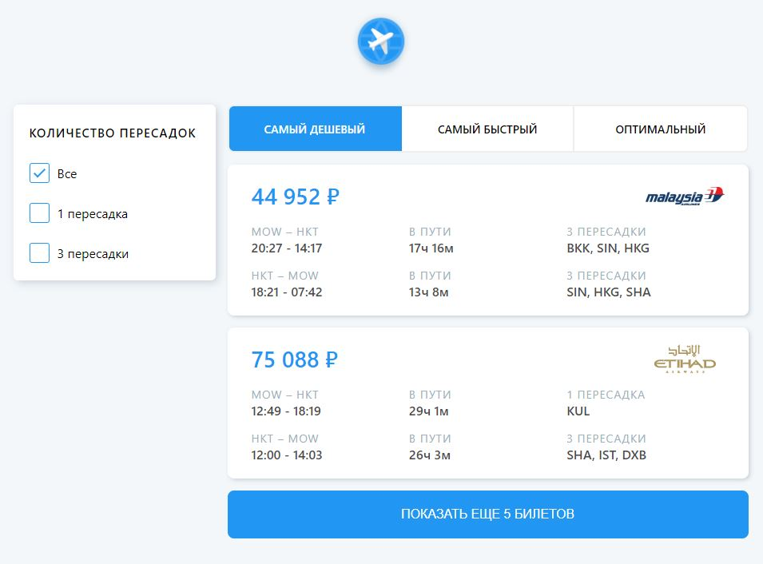

# Aviasales Testwork

Тестовое задание от компании Aviasales. Список билетов с фильтрами и сортировкой.

[Перейти к DEMO](https://avisales-testwork.vercel.app/)
 
## О проекте




Тестовое задание было написано на React. Билеты асинхронно загружаются с тестового сервера компании порциями по 5 шт. 

## Что было реализовано
**1. Фильтр по количеству пересадок**

- поля фильтра генерируются в зависимости от списка билетов

**2. Сортировка билетов**

- **по цене** (от дешевых к дорогим)
- **по времени в пути** (время туда + время обратно) (от быстрых к более долгим)
- **оптимальный** (считается кф-т - время * стоимость; чем ниже кф-т, тем выше показывается билет)

**3. Асинхронная подгрузка билетов**
> кнопка "Показать еще 5 билетов"
- во время загрузки на кнопке появляется **loader**
- после загрузки страница автоматически прокручивается вниз
- если загружены все билеты, кнопка становится неактивной

**4. Билет в модальном окне**
> клик по билету открывает его в модальном окне

**5. Вспомогательные функции**

- функция склонения слов (1 пересадк**а**, 2 пересад**ки**, 5 пересад**ок**)
- функции для работы с датой

## Для запуска

1. Клонируем репозиторий

```sh
git clone https://github.com/Perevoznikov/AviasalesTestwork.git
```

2. Устанавливаем необходимые зависимости

```sh
npm install
```

3. Запускаем сборку проекта

```sh
npm start
```


## Authors
[Perevoznikov Vladimir](https://github.com/Perevoznikov/) 
